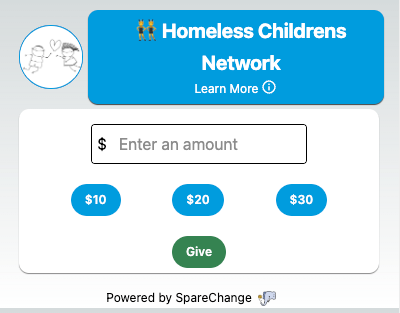

# 🧑‍💻 donationiFrame

SpareChange can be integrated into any iFrame location. `example.html` has a working example. 

    

### Query Parameters

| Parameter      | Type | Description     |
| :---        |    :----:   |          ---: |
| charityEIN [required]      | string        | The charity to support. Please look below on how to find EIN values  |
| color [optional]   | string        | Optional color to use when rendering iFrame instead of default (hex or string)    |
| presetAmount1 [optional]   | number[]        | First present number to present (need all 3 to work)       |
| presetAmount2 [optional]   | number[]        | Second present number to present (need all 3 to work)       |
| presetAmount3 [optional]   | number[]        | Third present number to present (need all 3 to work)       |

### Resources

##### Determining EIN 

You can use the following search to across charities to get EIN: [https://getsparechange.com/charitySearch/?showEIN=1](https://getsparechange.com/charitySearch/?showEIN=1))

This can be used to find EIN numbers for users.

### Examples

Please see `example.html` for working iFrame example. Below are different URLs that can be used. Also see `exampleCustomAmounts.html` for an example with custom amounts and `exampleCustomColors.html` for an example with custom colors.

### Speed

Testing
